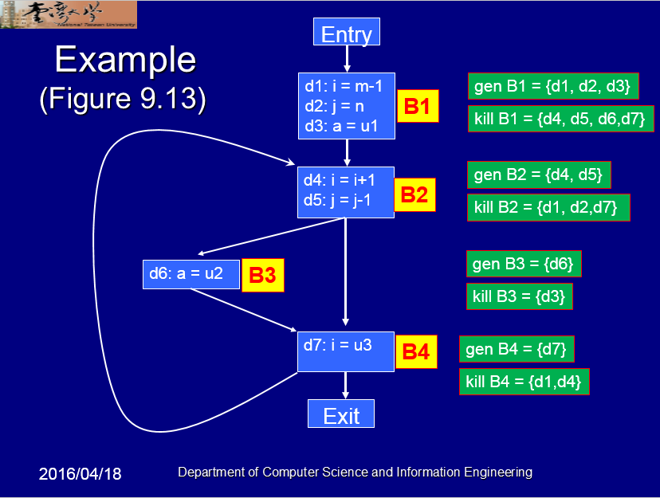

## Liveness ##

A variable is live out if used by a successor.

### Algorithm ###

```
// initialization
IN[exit] = 0
foreach B other than entry
	IN[B] = 0

// iterating until reaching fixed point
While some OUT[B] changes
	IN[B] = USE[B] union (OUT[B] - DEF[B])
	OUT[B] = UNION IN[S] where S in Successor(B)
```

### Example ###



### Sample Input ###

<pre>```
Entry -> B1
B1 -> B2
B2 -> B3
B2 -> B4
B3 -> B4
B4 -> B2
B4 -> Exit
```
```
B1
d1 i m
d2 j n
d3 a u1
B2
d4 i i
d5 j j
B3
d6 a u2
B4
d7 i u3
```</pre>

### Sample Output ###

```
=== Basic Block Information ===
        --- Entry ---
        --- Exit ---
        --- B1 ---
                d1 : i , m
                d2 : j , n
                d3 : a , u1
        --- B2 ---
                d4 : i , i
                d5 : j , j
        --- B3 ---
                d6 : a , u2
        --- B4 ---
                d7 : i , u3
===

=== Basic Block Liveness ===
        --- Entry ---
                DEF :
                USE :
                IN  : m n u1 u2 u3
                OUT : m n u1 u2 u3
        --- Exit ---
                DEF :
                USE :
                IN  :
                OUT :
        --- B1 ---
                DEF : i j a
                USE : m n u1
                IN  : m n u1 u2 u3
                OUT : i j u2 u3
        --- B2 ---
                DEF : i j
                USE : i j
                IN  : i j u2 u3
                OUT : j u2 u3
        --- B3 ---
                DEF : a
                USE : u2
                IN  : j u2 u3
                OUT : j u2 u3
        --- B4 ---
                DEF : i
                USE : u3
                IN  : j u2 u3
                OUT : i j u2 u3
===
```

### Reference ###

NTU Department of Computer Science and Information Engineering - Advanced Compiler
