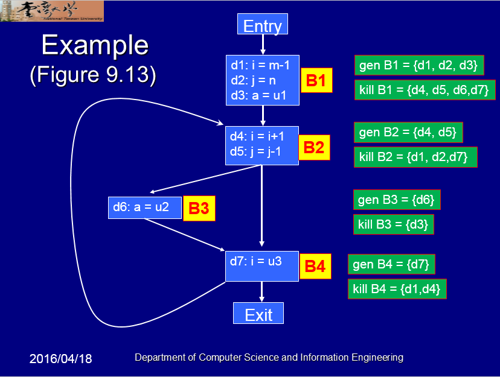

## Reaching Definition ##

### Algorithm ###

```
// initialization
OUT[entry] = 0
foreach B other than entry
	OUT[B] = 0

// iterating until reaching fixed point
While some OUT[B] changes
	OUT[B] = GEN[B] union (IN[B] - KILL[B])
	IN[B] = UNION OUT[P] where P in Pred(B)
```

### Example ###



### Sample Input ###

<pre>```
Entry -> B1
B1 -> B2
B2 -> B3
B2 -> B4
B3 -> B4
B4 -> B2
B4 -> Exit
```
```
B1
d1 i m
d2 j n
d3 a u1
B2
d4 i i
d5 j j
B3
d6 a u2
B4
d7 i u3
```</pre>

### Sample Output ###

```
=== Basic Block Information ===
        --- Entry ---
        --- Exit ---
        --- B1 ---
                d1 : i , m
                d2 : j , n
                d3 : a , u1
        --- B2 ---
                d4 : i , i
                d5 : j , j
        --- B3 ---
                d6 : a , u2
        --- B4 ---
                d7 : i , u3
===

=== Basic Block Reaching Definition ===
        --- Entry ---
                GEN :
                KILL:
                IN  :
                OUT :
        --- Exit ---
                GEN :
                KILL:
                IN  : d3 d5 d6 d7
                OUT : d3 d5 d6 d7
        --- B1 ---
                GEN : d1 d2 d3
                KILL: d4 d5 d6 d7
                IN  :
                OUT : d1 d2 d3
        --- B2 ---
                GEN : d4 d5
                KILL: d1 d2 d7
                IN  : d1 d2 d3 d5 d6 d7
                OUT : d3 d4 d5 d6
        --- B3 ---
                GEN : d6
                KILL: d3
                IN  : d3 d4 d5 d6
                OUT : d4 d5 d6
        --- B4 ---
                GEN : d7
                KILL: d1 d4
                IN  : d3 d4 d5 d6
                OUT : d3 d5 d6 d7
===
```

### Reference ###

NTU Department of Computer Science and Information Engineering - Advanced Compiler